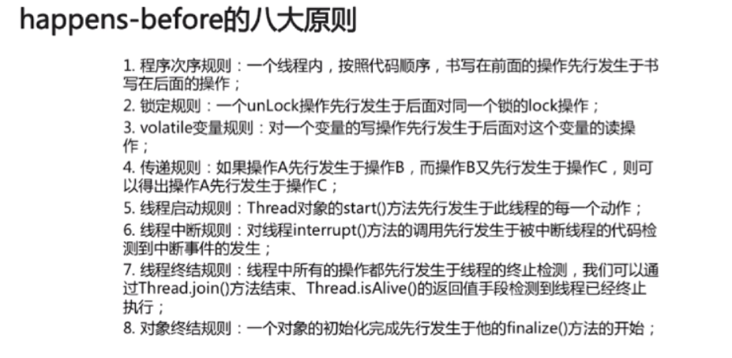
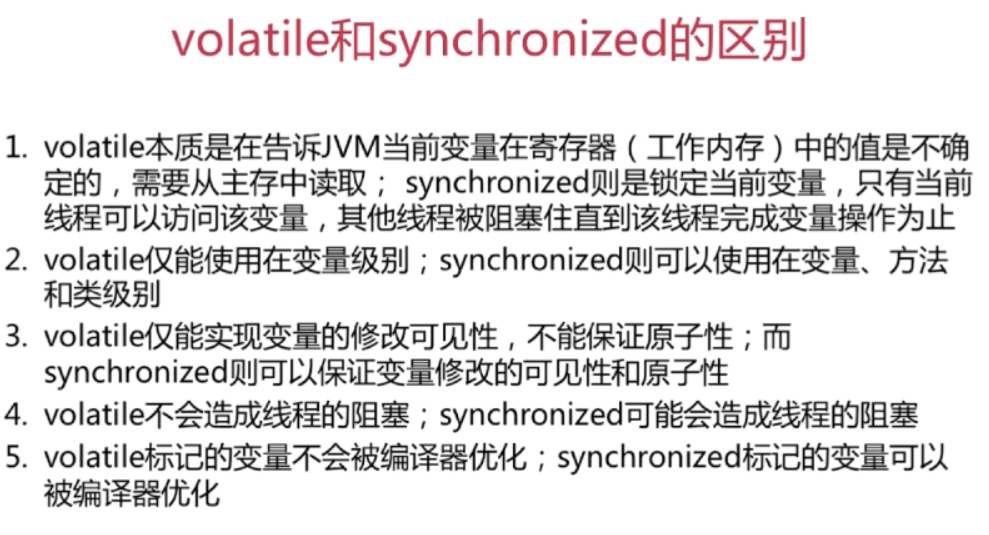
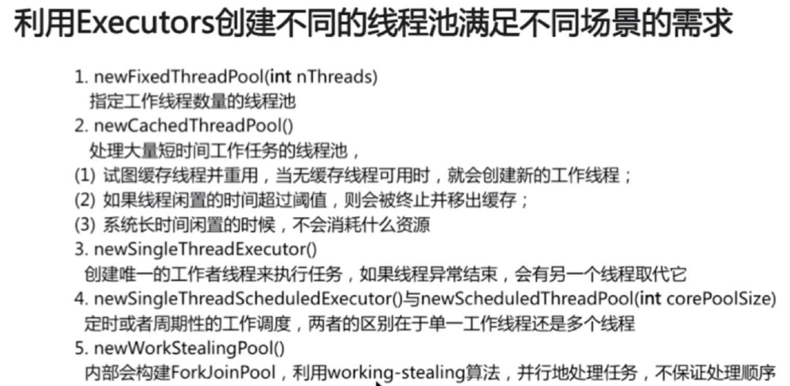
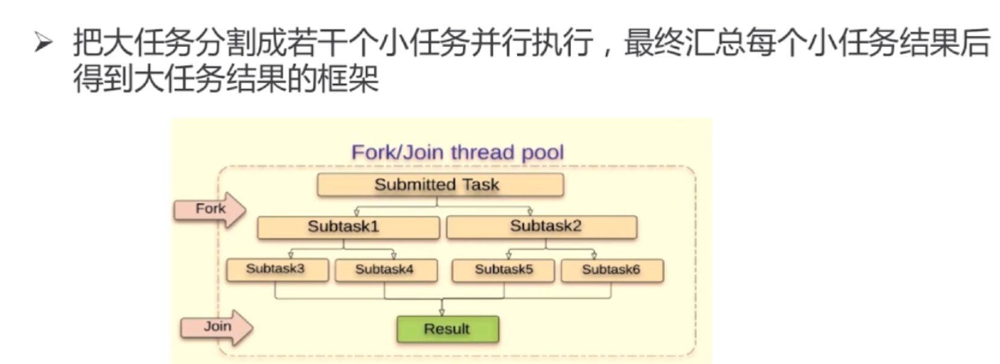
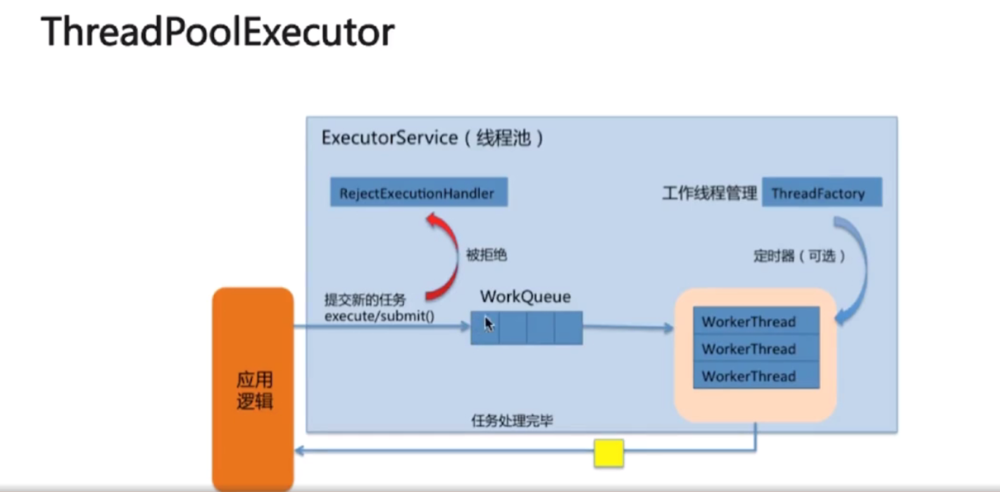
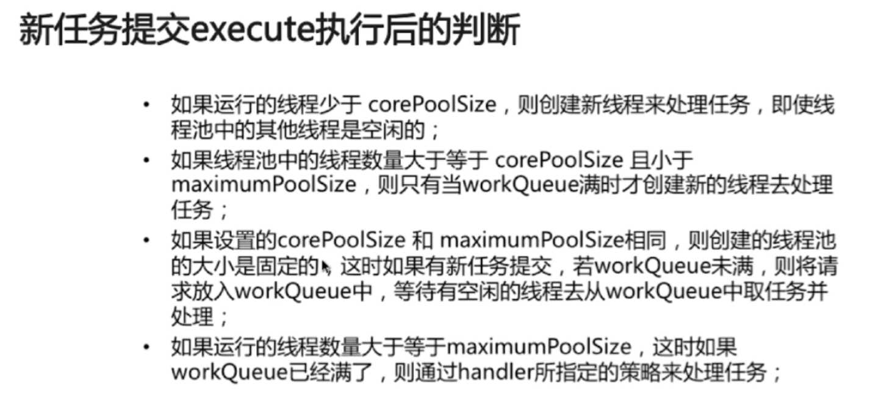
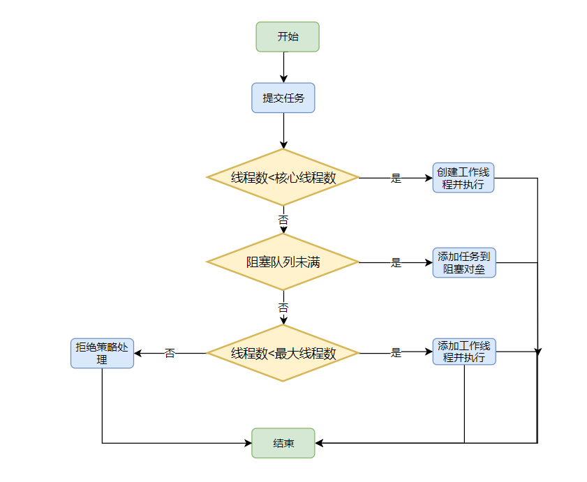
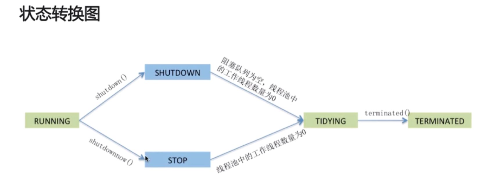
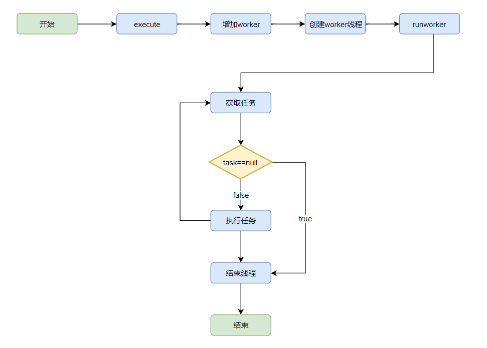

[TOC]

# Java虚拟机


## 程序计数器

- 当前线程所执行的字节码行号指示器（逻辑）
- 线程私有
- 改变计数器的值来选取下一条需要执行的字节码指令
- 对 Java 方法计数，如果是Native方法则计数器值为 Undefined
- 不会发生内存泄漏

如果线程正在执行Java方法，这个计数器记录的是正在执行的虚拟机字节码指令的地址

如果正在执行的是Native方法，这个计数器的值为null

## Java虚拟机栈

- Java方法执行的内存模型

- 线程私有的内存区域

- 包含多个栈帧，每个方法在执行的同时都会创建一个栈帧，用来存储局部变量表，操作数栈，动态连接和方法出口等信息。

- 生命周期和当前线程的生命周期一致

  

##### 局部变量表和操作数栈

- 局部变量表：包含方法执行过程中的所有变量
- 操作数栈：入栈、出栈、复制、交换、产生消费变量

```java
public static int add(int a, int b) {
		int c = 0;
		c = a + b;
		return c;
}
// 反汇编
public static int add(int, int);
    descriptor: (II)I
    flags: ACC_PUBLIC, ACC_STATIC
    Code:
      stack=2, locals=3, args_size=2
         0: iconst_0
         1: istore_2 // 将操作数栈中pop出放在局部变量表中第二个位置
         2: iload_0 // 将局部变量表中第一个数压入栈中
         3: iload_1 // 将局部变量表中第二个数压入栈中
         4: iadd // 将栈中的数弹出相加，然后放入栈中
         5: istore_2
         6: iload_2
         7: ireturn
      LineNumberTable:
        line 7: 0
        line 8: 2
        line 9: 6

```

##### 递归为什么会引起java.lang.StackOverflowError异常？

##### Class中变量内存的分配问题

- 当一个方法执行的时候，每个方法都会建立一个自己的内存栈，在这个方法内定义的变量将会返回逐个放入这块栈内存里，随着方法的执行结束，这个方法的内存栈也将自然销毁。因此所有在方法中定义的局部变量都是放在栈内存中的；
- 当创建一个对象的时候，这个对象将被保存到运行时的数据区中，以便反复的利用，这个运行的数据区就是堆内存，堆内存中的对象不会随着方法的结束而销毁，即使方法结束后后这个对象还是可能被另一个引用变量所引用，则这个对象依然不会被销毁，只有当一个对象没有任何引用它的时候，系统的垃圾回收器才会在合适的时候回收它。

## 本地方法栈

本地方法栈和Java虚拟机栈所发挥的作用类似，他们之间的区别只不过是Java虚拟机栈是为java为虚拟机执行Java方法服务的，而本地方法栈是为虚拟机使用Native方法服务的。


## Java Heap

- 对象实例及数组的分配区域
- 是所有线程共享的一块内存区域，在虚拟机启动的时候创建，也是虚拟机管理的最大的一块内存区域
- 也是GC发生的主要区域，这里采用分代进行回收
- JDK1.8 字符串常量池被转移到堆中

##### GC为什么要进行分代回收？

为了方便垃圾回收，大部分对象会立即不会使用，也有些对象会持续一些时间，所以将堆物理上划分为年轻代、老年代、永久代

年轻代: Eden 、 Survivor1、Survivor2

老年代：Tenured

永久代:  PerGen

##### JVM三大性能调优参数-Xms -Xmx -Xss含义

-Xss:规定了每个线程虚拟机栈（堆栈）的大小

-Xms:堆的初始值

-Xmx:堆能达到的最大值

一般我们把-Xms和-Xmx设置成一样大的，防止堆扩容的时候，内存抖动问题。

## 方法区 Method Area

- 是各个线程共享的一块内存区域，用来存储已经被虚拟机加载的类信息，常量，静态变量，即使编译后的代码信息。
- 运行时常量池是方法去的一部分，Class文件中除了有类的版本，字段，方法，接口等描述信息之外，还有一项信息是常量池，用存放编译后的字面量和符号引用，这部分信息到类加载之后放到方法区运行时常量池中存放。
- JDK8中永久代被移除，取而代之的是元数据区，元数据是堆外直接内存，可以提供更大内存空间。

##### 元空间与永久代的区别？

- 元空间使用本地内存，而永久代使用的是JVM的内存

##### MetaSpace相比PermGen的优势？

- 字符串常量池存在永久代中，容易出现性能问题和内存溢出。
- 类的方法的信息大小难易确定，给永久代的大小指定带来困难。
- 永久代会为GC带来不必要的复杂性。

##### Java内存模型中堆和栈的区别？

内存分配策略

- 静态存储： 编译时确定每个数据目标在运行时的存储空间需求

- 栈式存储： 数据区需求在编译时未知，运行时模块入口前确定。

- 堆式存储：编译时或运行时模块入口都无法确定，动态分配。

- 栈里定义变量保存堆中目标的首地址。

- 栈自动释放，堆需要GC

- 栈比堆小

- 栈产生的碎片远小于堆

- 栈支持静态和动态分配，而堆仅支持动态分配

- 栈的效率比堆高


JDK6：当调用intern方法时，如果字符串常量池先前已经创建出该字符串对象，则返回池中的该字符串的引用。否则，将此字符串对象添加到字符串常量池中，并且返回该字符串对象的引用。

JDK6+：当调用intern方法时，如果字符串常量池先前已创建出该字符串对象，则返回池中的该字符串的引用。否则，如果该字符串对象已经存在于Java堆中，则将堆中对此对象的引用添加到字符串常量池中，并且返回该引用；如果堆中不存在，则在池中创建该字符串并返回其引用。

```java
String s = new String("a"); // 字符串常量池中没有a对象，此步骤相当于创建了两个对象，一个在常量池中创建了a对象，另外在堆中创建了该对象
s.intern();
String s2 = "a";
System.out.println(s == s2);

String s3 = new String("a") + new String("a");
s3.intern();
System.out.println(s3 == s4);
```

JDK6 false false


JDK6+ 结果为 false  true


## 对象的创建

当虚拟机遇见new指令之后，检查这个指令的参数是否能在常量池中定位到一个类的符号引用，并检查这个符号引用所代表的类时候已经被加载，解析，初始化，如果没有执行类的加载过程，当类加载检查通过之后，虚拟机开始为对象分配内存，主要有两种方式，一是采用指针碰撞，二是采用空闲列表的方法。为了保证多个线程并发的安全，通过采用CAS来保证内存分配的同步，二是为每个线程分配本地线程分配缓冲。内存分配完成之后，虚拟机要将分配的内存初始化为零值。设置对象的类型指针，哈希值，对象的GC分代年龄等信息。在执行new 指令之后，会紧接着执行<init> 方法。

### 对象的内存布局

- 对象头
- 实例数据
- 对齐填充

### 对象的访问定位

- 句柄
- 直接指针

如果使用句柄访问的话，Java堆中划分出一块内存区域来作为句柄池，reference中存储的就是对象的句柄地址，而句柄中包含了对象那个的实例数据与类型数据各自的具体地址信息。

如果用直接指针访问的话，引用中保存的直接是对象的地址。

使用句柄的好处就是，引用存储的是稳定的句柄地址，当对象被移动之后，只会改变句柄中实例数据指针。而引用不需要改变

使用直接引用的好处，就是减少了一次指针的定位，速度更加快。对于HotSpot采用的是直接地址访问。

# Java类加载机制


## 类加载的时机

- 隐式加载 new 创建类的实例,
- 显式加载：loaderClass,forName等
- 访问类的静态变量，或者为静态变量赋值
- 调用类的静态方法
- 使用反射方式创建某个类或者接口对象的Class对象。
- 初始化某个类的子类
- 直接使用`java.exe`命令来运行某个主类


## 类加载的过程

我们编写的`java`文件都是保存着业务逻辑代码。`java`编译器将 `.java` 文件编译成扩展名为 `.class` 的文件。.class 文件中保存着java转换后，虚拟机将要执行的指令。当需要某个类的时候，java虚拟机会加载 .class 文件，并创建对应的class对象，将class文件加载到虚拟机的内存，这个过程被称为类的加载。


#### 加载 

从文件到内存

类加载过程的一个阶段，ClassLoader通过一个类的完全限定名查找此类字节码文件，并利用字节码文件创建一个Class对象。

#### 验证

目的在于确保class文件的字节流中包含信息符合当前虚拟机要求，不会危害虚拟机自身的安全，主要包括四种验证：文件格式的验证，元数据的验证，字节码验证，符号引用验证。

#### 准备

1. 为类变量（ static 修饰的字段变量）分配内存并且设置该类变量的初始值，这里的内存分配都在方法区上（如static int i  = 5 这里只是将 i 赋值为0，在初始化的阶段再把 i 赋值为5)，这里不包含final修饰的static ，因为final在编译的时候就已经分配了。
2. 这里不会为实例变量分配初始化，类变量会分配在方法区中，实例变量会随着对象分配到 Java 堆中。 

#### 解析

这里主要的任务是把常量池中的符号引用替换成直接引用

#### 初始化

这里是类记载的最后阶段。执行其静态初始化器（静态代码块）和静态初始化成员变量。

- 前面已经对 static 初始化了默认值，这里我们对它进行赋值，成员变量也将被初始化
- 使用 new 关键字进行主动创建一个类的实例的时候进行初始化
- 使用 forName() 进行反射创建一个类对象
- 对类进行反射调用，如果类还没有进行初始化，则先进行初始化操作。
- 当对一个类进行初始化操作的时候，发现父类还没有初始化，先对父类进行初始化。
- 当虚拟机启动的时候，用户需要指定一个主类，虚拟机会先初始化这个主类。

## 类加载器

类加载载器的任务是根据类的全限定名来读取此类的二进制字节流到 JVM 中，然后转换成一个与目标类对象的java.lang.Class 对象的实例，在java 虚拟机提供三种类加载器。

- 引导类加载器 <JAVA_HOME> /lib
- 扩展类加载器 <JAVA_HOME> /lib/ext
- 系统类加载器 java -classpath
- 定制类加载器

## forName和loaderClass区别

- Class.forName()得到的class是已经初始化完成的。
- Classloader.loaderClass得到的class是还没有链接（验证，准备，解析三个过程被称为链接）的。

## 双亲委派

双亲委派模式要求除了顶层的启动类加载器之外，其余的类加载器都应该有自己的父类加载器，但是在双亲委派模式中父子关系采取的并不是继承的关系，而是采用组合关系来复用父类加载器的相关代码。

在加载一个类的时候先委托给父类进行加载，如果父类不能加载则由子类尝试进行加载

避免了类的重复加载，也避免了 Java 核心 API 被篡改

```java
protected Class<?> loadClass(String name, boolean resolve)
    throws ClassNotFoundException {
    // 增加同步锁，防止多个线程加载同一类
    synchronized (getClassLoadingLock(name)) {
        // First, check if the class has already been loaded
        Class<?> c = findLoadedClass(name);
        if (c == null) {
            long t0 = System.nanoTime();
            try {
                if (parent != null) {
                    c = parent.loadClass(name, false);
                } else { // ExtClassLoader没有继承BootStrapClassLoader
                    c = findBootstrapClassOrNull(name);
                }
            } catch (ClassNotFoundException e) {
                // ClassNotFoundException thrown if class not found
                // from the non-null parent class loader
            }

            if (c == null) {
                // If still not found, then invoke findClass in order
                // to find the class.
                long t1 = System.nanoTime();
                // AppClassLoader去我们项目中查找是否有这个文件，如有加载进来
                // 没有就到用户自定义ClassLoader中加载。如果没有就抛出异常
                c = findClass(name);

                // this is the defining class loader; record the stats
                sun.misc.PerfCounter.getParentDelegationTime().addTime(t1 - t0);
                sun.misc.PerfCounter.getFindClassTime().addElapsedTimeFrom(t1);
                sun.misc.PerfCounter.getFindClasses().increment();
            }
        }
        if (resolve) {
            resolveClass(c);
        }
        return c;
    }
}
```


#### 工作原理

​	如果一个类收到了类加载的请求，它并不会自己先去加载，而是把这个请求委托给父类加载器去执行，如果父类加载器还存在父类加载器，则进一步向上委托，依次递归，请求最后到达顶层的启动类加载器，如果父类能够完成类的加载任务，就会成功返回，倘若父类加载器无法完成任务，子类加载器才会尝试自己去加载，这就是双亲委派模式。就是每个儿子都很懒，遇到类加载的活都给它爸爸干，直到爸爸说我也做不来的时候，儿子才会想办法自己去加载。

#### 优势

采用双亲委派模式的好处就是Java类随着它的类加载器一起具备一种带有优先级的层次关系，通过这种层级关系可以避免类的重复加载，当父亲已经加载了该类的时候，就没有必要子类加载器（ClassLoader）再加载一次。其次是考虑到安全因素，Java核心API中定义类型不会被随意替换，假设通过网路传递一个名为java.lang.Integer的类，通过双亲委派的的模式传递到启动类加载器，而启动类加载器在核心Java API发现这个名字类，发现该类已经被加载，并不会重新加载网络传递过来的java.lang.Integer.而之际返回已经加载过的Integer.class，这样便可以防止核心API库被随意篡改。可能你会想，如果我们在calsspath路径下自定义一个名为java.lang.SingInteger?该类并不存在java.lang中，经过双亲委托模式，传递到启动类加载器中，由于父类加载器路径下并没有该类，所以不会加载，将反向委托给子类加载器，最终会通过系统类加载器加载该类，但是这样做是不允许的，因为java.lang是核心的API包，需要访问权限，强制加载将会报出如下异常。

```java
java.lang.SecurityException:Prohibited package name: java.lang
```


### 类与类加载器

- 在JVM中标识两个Class对象，是否是同一个对象存在的两个必要条件
- 类的完整类名必须一致，包括包名。
- 加载这个ClassLoader（指ClassLoader实例对象）必须相同。


### 双亲委派模式的破坏者：线程上下文类加载器


在Java应用中存在着很多服务提供者接口（Service Provider Interface，SPI），这些接口允许第三方为它们提供实现，如常见的 SPI 有 JDBC、JNDI等，这些 SPI 的接口属于 Java 核心库，一般存在rt.jar包中，由Bootstrap类加载器加载，而 SPI 的第三方实现代码则是作为Java应用所依赖的 jar 包被存放在classpath路径下，由于SPI接口中的代码经常需要加载具体的第三方实现类并调用其相关方法，但SPI的核心接口类是由引导类加载器来加载的，而Bootstrap类加载器无法直接加载SPI的实现类，同时由于双亲委派模式的存在，Bootstrap类加载器也无法反向委托AppClassLoader加载器SPI的实现类。在这种情况下，我们就需要一种特殊的类加载器来加载第三方的类库，而线程上下文类加载器就是很好的选择。

线程上下文类加载器（contextClassLoader）是从 JDK 1.2 开始引入的，我们可以通过java.lang.Thread类中的getContextClassLoader()和 setContextClassLoader(ClassLoader cl)方法来获取和设置线程的上下文类加载器。如果没有手动设置上下文类加载器，线程将继承其父线程的上下文类加载器，初始线程的上下文类加载器是系统类加载器（AppClassLoader）,在线程中运行的代码可以通过此类加载器来加载类和资源，如下图所示，以jdbc.jar加载为例


### 对象的创建过程

当虚拟机遇到一个`new`的指令的时候，首先去检查这个指令是否能在`常量池`中定位到一个类的符号引用，并检查这个符号引用代表的类是否已经被加载，解析和初始化过。如果没有则执行相应初始化的过程。在类加载检查通过后，接下来虚拟机将为新生对象分配内存，`对象所需要的内存的大小在类加载完成后便可以完成确定`。`内存分配完成以后，虚拟机需要将分配的内存空间都初始化为零值`，保证了对象的实例字段在Java代码中可以不赋予初值就直接使用，程序能访问到这些字段的数据类型对应的零值。再接下来对象需要进行必要的设置，这个对象是哪个类的实例，如何才能找到这个类的元数据信息，如何找到对象的哈希码，对象的GC分带年龄。

- Java堆如果是规整的采取：指针碰撞，
- Java堆如果不是规整的话：空闲列表，在内存中直接分配一个足够大的内存空间划分给对象。
- 对象创建是非常平凡的，在多线程的程序中会产生线程安全的问题，所以解决这个问题有两种方式
- 使用CSA配上失败重试的方式来保证原子性
- 内存分配动作按照线程划分在不同的空间之中进行，即每个线程在java堆中预先分配一个小块的内存成为本地分配缓冲，TLAB,哪个线程需要分配内存就在哪个线程的TALB上分配，只有在TALB用完之后才会重新分配新的TALB的时候才会同步锁定。

### 对象的内存布局

对象的内存布局一般分为三个部分：对象头，示例数据，对齐填充

对象头中存放着对象自身的运行时数据，如哈希码，GC分带年龄，锁状态标志，偏向线程ID，线程持有的锁。

对象头另外一部分还有`类型指针`，对象指向它类元数据的指针，虚拟机通过这个指针来确定这个对象是哪个类的实例。如果对象是一个java数组，那在对象头中还必须用一块用于记录数组长度的数据。因为虚拟机可以通过普通java对象的元数据信息确定java对象的大小。


### 对象的访问定位方式

#### 句柄和直接指针

- 如果使用句柄的话，要在java堆中开辟一个句柄池，用来存放句柄地址，句柄地址中包含对象实例数据（堆）和类型数据（方法区）各自的地址信息。
- 是用句柄的好处就是引用中存储的是稳定的句柄地址，当被移动时只会修改句柄中的实例数据指针，而引用地址不会被改变。
- 使用直接指针访问方式的最大好处就是速度更快，它节省了一次访问指针定位的时间开销，引用直接指向存放实例数据的堆内存，在该内存中存放着指向方法区的类型数据地址。


## JMM

java内存模型（Java Memory Model）本身是一种抽象的概念，并不真实存在，它描述的是一组规则或者规范，通过这组规则和规范定义了程序中各个变量（包括实例字段，静态字段，和构成数组对象的元素）的访问方式。


JMM中的主内存

- 存储Java实例对象
- 包括成员变量，类信息，常量，静态变量等
- 属于数据共享的区域，多线程并发操作时候，会引起线程安全问题

JMM的工作内存

- 存储当前方法的所有本地变量信息，本地变量对其它线程是不可见的
- 字节码行号指示器，Native方法信息
- 属于线程私有数据区域，不存在线程安全问题

JMM内存模型和Java内存区域划分的概念层次

JMM描述的是一组规则，围绕原子性，有序性，可见性展开的

存在私有区域和公有区域

主内存与工作内存的数据存储类型以及操作方式归纳

- 方法里的基本数据类型本地变量将存储在工作内存中的栈帧中
- 引用类型的本地变量，引用存储在工作内存中，实例存储在主内存中
- 成员变量，static变量，类信息均会存储在主内存中
- 主内存共享的方式是线程拷贝一份数据到工作内存，操作完成后刷新主内存中。

JMM如何解决可见性？

##### 指令重排序需要满足的条件

- 单线程环境下不能改变程序的结果

- 存在数据依赖关系的不允许重排序

- 无法通过happens-before原则推导出来的，才能进行指令重排序


A操作的结果需要对B操作可见，则A与B存在happens-before关系

那么操作A在内存上所做的操作，对操作B都是可见的。

```java
i = 1; // 线程a执行
j = i; // 线程b执行
```




##### volatile：JVM提供的轻量级同步机制

- 保证被volatile修饰的共享变量对所有线程总是可见的
- 禁止指令重排序优化

volatile变量为何立即可见？

当写一个volatile变量时，JMM会把该线程对应的工作内存中的共享变量值刷新到主内存中。

当读取一个volatile变量时，JMM会把该线程对应的工作内存置为无效。

##### volatile如何禁止重排优化？

内存屏障

1. 保证特定操作的执行排序
2. 保证某些变量的内存可见性
3. 通过插入内存屏障指令禁止在内存屏障前后的指令执行重排序优化
4. 强制刷出各种CPU的缓存数据，因此任何CPU上的线程都能读取到这些数据的最新版本

```java
public class Singleton {
    private volatile static Singleton instance;
    private Singleton(){}
    public static Singleton getInstance() {
        // 第一次检测
        if(instance == null){
            // 同步
            synchronized (Singleton.class) {
                if(instance == null) {
                    // 多线程环境下可能会出现问题的地方
                    instance = new Singleton();
                }
            }
        }
        return instance;
    }
}
```

在instance= new Singleton();创建一个对象的时候，这一行可以分解为如下三行代码。

```java
memory = allocate(); // 1.分配对象的内存空间
instance = memory(); // 3.设置instance指向分配的内存地址，此时对象还没初始化！
ctorInstance(memory); // 2.初始化对象
```

由于2和3发生了重排序                                                                                                                                                                                                                                                                                                                                                                     



### CAS

- 支持原子更新操作，使用与计数器，序列发生器等场景
- 属于乐观锁机制
- CAS操作失败时，由开发者决定继续尝试，还是还是执行别的操作，不会被阻塞

##### CAS思想

包含三个操作数，内存位置V，预期原值A和新值B

缺点

循环时间长，开销大

只能保证一个共享变量

ABA问题

##### Java线程池



##### Fork/Join框架

Work-Stealing算法：某个线程从其它线程队列里窃取任务来执行



##### 为什么要使用线程池？

- 降低资源消耗
- 提高线程的可管理性



```java
public ThreadPoolExecutor(int corePoolSize, // 核心线程数量
                              int maximumPoolSize, // 线程不够用时能够创建的最大线程数
                              long keepAliveTime, // 空闲时间保持线程的存活时间
                              TimeUnit unit,
                              BlockingQueue<Runnable> workQueue, // 任务等待队列
                              ThreadFactory threadFactory, // 线程工厂
                          		// 线程饱和策略
                              RejectedExecutionHandler handler ) {}
```

饱和策略

- AbortPolicy:直接抛出异常，这是默认策略
- CallerRunsPolicy:调用者所在的线程来执行任务
- DiscardOldestPolicy:丢弃队列中靠前的任务，并执行当前任务
- DiscardPolicy:直接丢弃任务
- 实现RejectedExecutionHandler接口自定义handler







##### 线程生命周期



##### 线程池的大小如何选定？

CPU密集型：线程数=按照核数+1设定

I/O密集型：线程=CPU核数*（1+平均等待时间/平均工作时间）